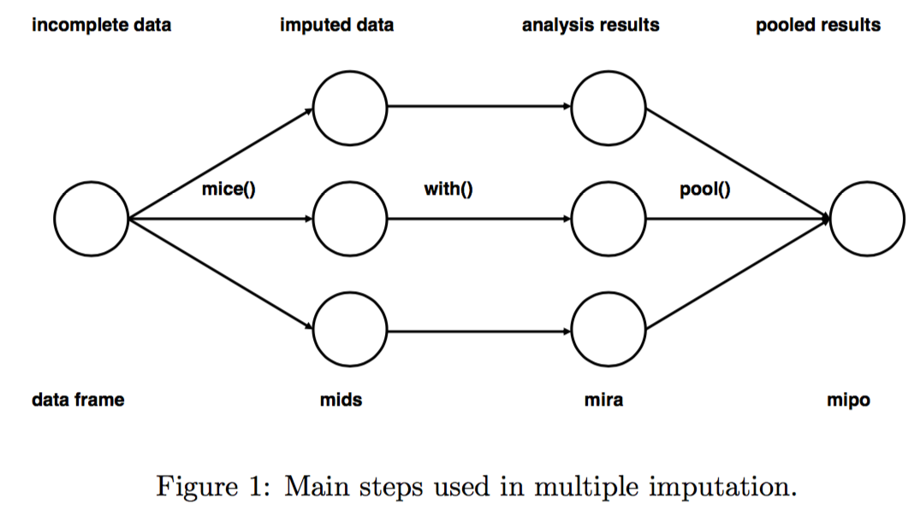

```{r setup, include=FALSE}
#knitr::opts_knit$set(root.dir = "../")
knitr::opts_chunk$set(message=FALSE, warning=F, echo=F, fig.align="center")
options(width = 2000)
options(repos="https://cran.rstudio.com")

require(tidyverse)
```

# About me

- Currently an assistant professor of Urban Studies and Planning at Portland State University
- Did dissertation research on urban simulation models (with Paul Waddell)
- Worked as a developer for UrbanSim for a number of years
- Research interests on land use - transportation interaction (LUTI) models
- Never had formal computer science training/background

---

# Statistical Modeling vs Machine Learning

Two cultures of developing models (Breiman, 2001):

.pull-left[


**Statistical models** ("the data modeling"): Assuming a data generation model and use data and hypothesis testing framework to recover parameters of the data generation process;
]

.pull-right[


**Machine learning** ("algorithmic modeling"): With no assumption of data generation process, use computer algorithms for pattern recognition and data-driven predictions-making

]

---

background-image: url("resources/wired_end_of_theory.png")
background-size: 100%

---

# Challenges to Statistical Models

Or the case for machine learning:

- Assumption/theory of the data generation process may be wrong
- Competing data generation models may give different pictures of the relation between the predictors and response variable;
- Changing landscape of data availability
   - Curse of dimensionality
   - Easy to detect significant correlations with large sample size
   - Increasingly models involving data of the population instead of a sample
   - Missing data issue

---

# Two Case Studies

- Imputation of missing data in travel surveys
- Models travel outcomes

---

# Case I: Imputation of Missing Data 

Annual Vehile Miles Travelled information in the 2001 National Household Travel Survey (NHTS)
<!-- missingness -->

```{r, fig.height=4, dev='svg', cache=TRUE}
require(ggplot2)
require(forcats)

year <- "2001"
action <- "val"

oldwd <- getwd()
setwd("../../mice")
source("code/mice_NHTS.R")

vv_xx <- vv_input %>%
   as.list() %>%
   tibble::enframe() %>%
   #mutate(lvls=map(value, levels)
   mutate(`# Missing` = map_int(value, ~sum(is.na(.)) + sum(is.nan(.))),
          n = map_int(value, length),
          `% Missing` = 100 * `# Missing`/n
          ) %>%
   select(-value) %>%
   filter(!name %in% c("ANNUALZD2", "HOUSEID", "READDIFF", "VEHID", "YEAR", 
                       "PERSONID", "CENSUS_D", "MSASIZE"))

ggplot(vv_xx, aes(x=fct_reorder(name, `% Missing`), y=`% Missing`)) + 
  geom_col() + coord_flip() + 
  xlab("Variable")
setwd(oldwd)
```

Only 12% (`r vv_input %>% na.omit() %>% nrow()` out of `r vv_input %>% nrow`) observations are complete.

---

# Multiple Imputation by Chained Equations

```{r}

```
Source: van Buuren, Stef and Karin Groothuis-Oudshoorn, 2011. mice: Multivariate Imputation by Chained Equations in R, Journal of Statistical Software, Vol 45 (3).

---

# Imputation Results (1)

**Validation**: randomly set 10% of values to missing, impute them and compare with actual values

```{r}
val_df <- tribble(
  ~Variable, ~`Normalized RMSE`,
  "ANNMILES (Self reported annual VMT)", 31.824,
  "ANNUALZD (VMT annualized from two Odmeter readings)", 22.264,
  "HHFAMINC (Family income)", 0.0475
)
val_df %>% knitr::kable(format = 'html')
```

---

background-image: url("resources/mice_imp_demo.png")
background-size: 55%

**Imputation Results (2)**: Comparing linear regression results (y=ANNUALZD) without and with multiple imputation

---

# Case II: Travel Behavior Modeling

$$\text{VMT}_h \leftarrow (\text{SES}_h, \text{regional characteristics}, \text{built environment})$$
Data Sources:

- 2009 NHTS for household's SES, travel outcome (VMT);
- EPA's Smart Location Database (for blockgroup level 5D built environment measures);
- Highway Performance Measure System for regionwide roadway information;
- National Transit Database for regionwide transit supply.

150,000 households with more than 180 independent variables (before considering non-linear transformation or interaction between variables)

---

# VMT models

- Statistical Models
   - linear regression
   - non-linear regression (transformed dependent variable)
   - tobit model
   - zero-inflated negative binomial model
- Machine learning algorithms
   - Random Forest
   - Gradient Tree Boosting
   - Deep nureal network
   
---

# Cross Validation Results

- Dependent variable is household VMT on the day of survey
- Data are randomly partitioned into 5 parts for a 5-fold cross-validation

```{r, fig.height=4, dev='svg'}
library(tidyverse)
library(forcats)
cv_df <- tribble(
  ~Model, ~`Root Mean-Square Error`,
  "Box-Cox transformed regression", 17.54584,
  #"Semi-log regression", 82.11738,
  "Linear regression", 15.90242,
  "Negative bionomial", 24.27512,
  "Tobit", 16.34421,
  "Zero-inflated negative binomial", 15.75345,
  "Random forest", 15.75345,
  "Gradient Tree Boosting", 15.55720,
  "Deep learning", 15.67545
)  

ggplot(cv_df, aes(x=fct_reorder(Model, `Root Mean-Square Error`, .desc = TRUE), y=`Root Mean-Square Error`)) + 
  geom_col() + coord_flip() + 
  xlab("Model")
```

---

# Conclusion and Discussion

**Conclusions**:
- Some tasks, such as multivariate data imputation, are hard or impossible to do with statistical models but possible with machine learning, 
- Growing modeling complexity adds challenges to statistical models, machine learning has an advantage in complex models
- If you're developing models for prediction, there are few reasons not to look into machine learning algorithms

**Challenges**

- Combining machine learning skills with the domain knowledge of planning; 
- Train planning students with machine learning skills
- Computation intensity & access to computer resources

---

# Acknowledgements

- Oregon Department of Transportation (SPR 788) 
- National Institute for Transportation and Communities (NITC-881)
- Portland Institute for Computational Science and its resources acquired using NSF Grant #DMS 1624776 and ARO Grant #W911NF-16-1-0307

---

background-image: url("resources/Olson2018.png")
background-size: 80%
class: center, bottom

Benchmarking Machine Learning Algorithms

Source: Randal S. Olson and William La Cava et al., 2018.