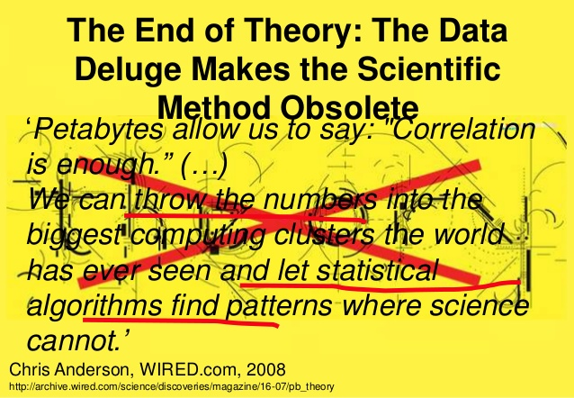

```{r setup, include=FALSE}
#knitr::opts_knit$set(root.dir = "../")
knitr::opts_chunk$set(message=FALSE, warning=F, echo=F, fig.align="center")
options(width = 2000)
options(repos="https://cran.rstudio.com")
```

# About me

- Currently an assistant professor of Urban Studies and Planning at Portland State University
- Never had formal computer science training/background
- Did dissertation research on urban simulation models (with Paul Waddell)
- Worked as a developer for UrbanSim for a number of years
- Research interests on land use - transportation interaction (LUTI) models

---

# Generative vs Descriminative Analysis

---

# 

```{r, out.width = "1240px"}

```

---

# 
<div style="text-align:center" markdown="1">


---

# Machine Learning
- The hype
- The definition

---

# Hal Varian's take

---

# Two Case Studies

- Imputation of missing data
- Predictive models of travel behavior

---

# Imputation of Missing Data for National Household Travel Survey (NHTS)

- Missing data issue is prevalent in travel surveys

---

# Assessment

- Value?
- Computation intensive

---

# Acknowledgements

